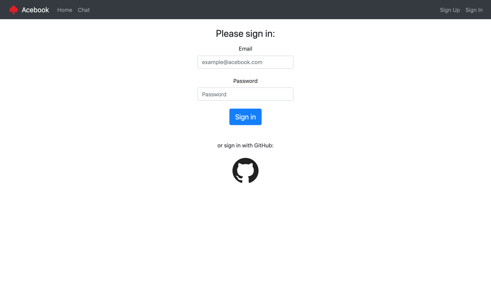
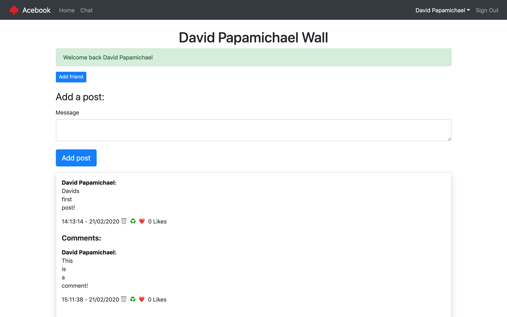
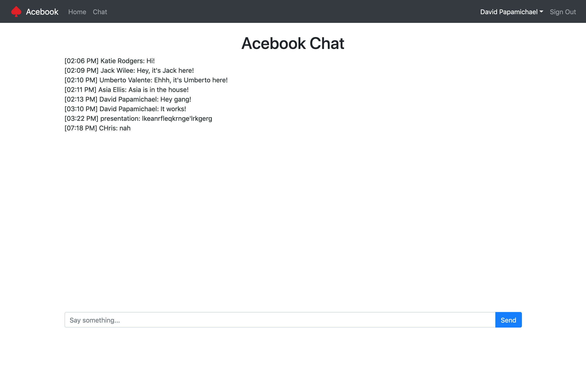

# AceBook

This was the second of the group projects at Makers. This time we had 2 weeks, and the brief was to complete a clone of Facebook. This was our first time using the Ruby on Rails framework, bootstrap design tools, as well as the Travis Continous Intergration tools and Rubocop linter.

It was a very enjoyable time working with the team. We worked closely, used AGILE practises and had constant feedback over the 2 week project, using stand-ups every morning, retrospectives every evening. The original repo can be found [*here*](https://github.com/asiaellis5/acebook-U-JAKD) - huge shout out to the team members Asia, Jack, Katie and Umberto. I enjoyed the project and learnt so much in such a short space of time. I gained valuable continous intergration and Rails skills gained over the course of this project, as well as an insight into the bootstrap/css world. 

We kept a running blog over the two week project that can be viewed [*here*](blog.md).

---

## Project

This project was aimed to simulate real life product delivery in the workplace. We had both a technical lead, and a product manager. We had strict requirements from the product manager that we had to adhere to, we then converted them into [*user stories*](userstories.md) and worked via 2 day sprints to deliver these features.

We also copied these user stories onto our group [*Trello Board*](https://trello.com/b/M4b8WWOm/u-jakd), making sure to update the status of each user story as and when they were actioned - then moving them into the relevant column.

You can find the endineering project outline [*here*](https://github.com/makersacademy/course/tree/master/engineering_projects/rails).

This project is designed to act as a social media site where users can:

- Sign up/ Sign in (also via Github) and sign out,
- Post content to their own wall, other uses walls or a joint wall,
- Comments can be added to each post,
- 'Likes' can be added to each post and/or comments, limited to one per user (then an unlike function is shown),
- Each username is a link to that persons own wall,
- A user can change their username at any time via the edit account function,
- Any users signed in on the site can click on the 'chat' button and be entered into a live chatroom.

---

## How to Run
Clone this repo, and in the command line run:

```
bundle install
```

Once the dependancies are installed, run the following command:

```
bin/rails db:create
```

Once the databases have been created, run:

```
bin/rails db:migrate
```

This will update all the databases with the necessary tables. The ap can then be launched by typing in the command line:

```
rails server
```

Finally enjoy Acebook by clicking on [*localhost:3000*](http://localhost:9292/) to open this up in your browser and start using!

The testing suite, RSpec, can be run by typing into the command line:

```
rspec
```

This will bring up all 63 passing tests, with >95% coverage.

## Live app

The current production version of the app gets automatically deployed with changes made into the master branch, and can be found hosted on [*Heroku*](https://acebook-u-jakd.herokuapp.com)

[](https://codeclimate.com/github/asiaellis5/acebook-U-JAKD/maintainability)

---

#### Login


#### Posts & Comments


#### Likes


#### Chat

